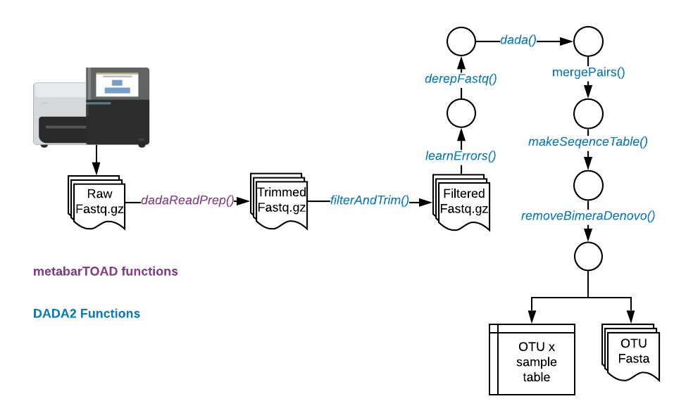
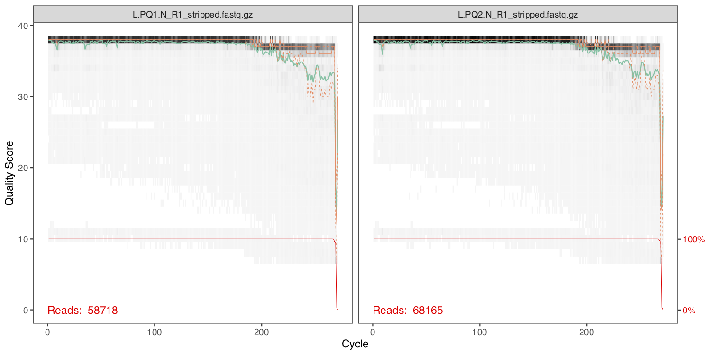
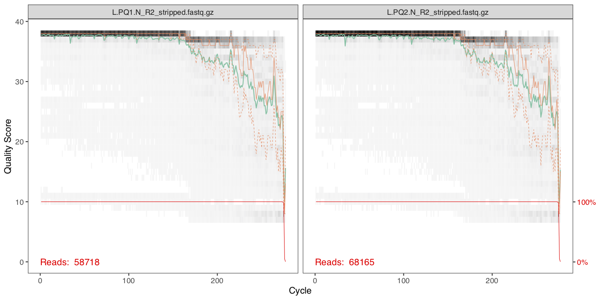
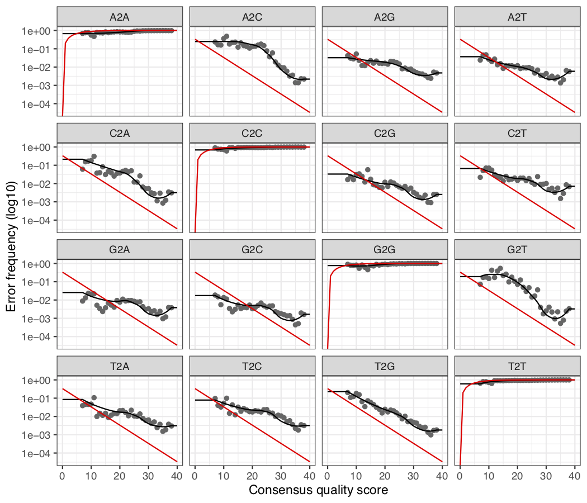

```{r setup, include = FALSE}
knitr::opts_chunk$set(
  collapse = TRUE,
  comment = "#>",
  eval = FALSE
)
```

Many contemporary metabarcoding workflows ignore quality information provided in FASTQ data, this can restrict their ability to accurately resolve low frequency amplicon diversity.

DADA2 is an approach (paper [here](https://benjjneb.github.io/dada2/index.html)) gaining popularity that integrates the quality information to build an model of sequence errors that allowing for very precise inference of amplicon sequences. Here, we show how DADA2 can be implimented in the metabarTOAD wrapper. 

### Requirements
#### Library design
This tutorial is designed for paired-end Illumina amplicon data generated from a 2-step PCR method as [Bista et al.2017](https://www.nature.com/articles/ncomms14087). We are expecting sufficient (>30bp) overlap of the paired end reads. DADA2 learns and performs amplicon inference according to the error model, specific to each Illumina run so samples from different runs should be analysed seperately. This tutorial is designed to analyse data from a single primer set at a time. 


#### Software
For this tutorial you will need the following 

* Cutadapt (version 2.0+)  [link](https://cutadapt.readthedocs.io/en/stable/installation.html)
* DADA2 (version 1.8+) [link](https://benjjneb.github.io/dada2/dada-installation.html)

Cutadapt should be installed and working on your system. For this tutorial don't worry but when you're on your own system keep a note of the directory path to the binary or have them in your PATH. Not sure about the PATH? - go [here](http://www.linfo.org/path_env_var.html)

## Workflow Overview



## Setting up 
Make sure you start off with a clean folder in a new working directory, in this case we have some files and folders to help you get started so don’t worry if you see these. Have a look with dir(). Let’s start by loading up the required package(s)

```{r}
require(metabarTOAD)
require(dada2)

```

If you previously used the metabarTOAD workflow to generate 97% OTUs or denoised OTUs with UNOISE3 then the correct folder structure is already in place. Otherwise use the below command to set up some folders for the analysis. 

```{r}
Folders()
```

Now we have a folder structure we would normally we would move our raw Illumina data into the 1.rawreads but it should already be there for you for this tutorial. You might wish to copy your raw files into the 0.backup folder as well in case you want to start the analysis again from scratch.

## Primer Stripping
DADA2 requires sequences that have been stripped of primer regions. We can use the below function to strip primers from both sets of read pairs at the same time. This is important as many downstream applications (such as DADA2) rely on reads appearing in the same order in both the forward and reverse read files. If we strip reads from read pairs individually we may end up filtering out a single read from a read pair resulting in unmatched pairs in our files. 

Unlike before you'll have to put in the primer data yourself. The file `primers.csv` is in this folder and has all the information you need to fill in the primer data below. 

```{r}
dadaReadPrep(PrimerF = "YOUR_FORWARD_PRIMER",
             PrimerR = "YOUR_REVERSE_PRIMER",
             cutadaptdest = "cutadapt", 
             ncores = 7
)
```

The function `dadaReadPrep()` will accept ambigous nucleotides in primer data (Y,M,R,N etc.) and will automatically convert inosine (I) bases to N.

You should now find your stripped reads in the directory `/7.DADA2/trimmed.reads/`. Have a look and check as below. 

```{r}
list.files("7.DADA2/trimmed.reads/")
path <- "7.DADA2/trimmed.reads/"
```

You should see a list of your files. The rest of this workflow follows the usual DADA2 pipeline outlined [here](https://benjjneb.github.io/dada2/tutorial.html). 


## Inspect Files 
First lets get the file names of the forward and reverse reads. We assume here your files have the format `****R1.stripped.fastq` and `****R2.stripped.fastq` for the forward and reverse reads respectivly. 

```{r}
fnFs <- sort(list.files(path, pattern="R1_stripped.fastq.gz", full.names = TRUE))
fnRs <- sort(list.files(path, pattern="R2_stripped.fastq.gz", full.names = TRUE))
```

We can then extract the files names as below. 

```{r}
sample.names <- sapply(strsplit(basename(fnFs), "_"), `[`, 1)
```

Now we should inspect the quality of the forward reads. We choose to look at the 3rd and 4th sample becuase the first two are controls. 

```{r}
pdf("quality_forward.pdf",width=10,height=5)
par(mfrow=c(2,1))
plotQualityProfile(fnFs[3:4])
dev.off()

```

Download the plots using Filezilla - they should look as below. 



These look very good. The data quality is high throughout the read and it only crashes in quality towards the end. Lets look at the reverse reads. 

```{r}
pdf("quality_reverse.pdf",width=10,height=5)
par(mfrow=c(2,1))
plotQualityProfile(fnRs[3:4])
dev.off()

```



These look a bit worse - you can see the quality really start to decrease towards the end of the read. However this is totally normal for Illumina reads. 

As DADA2 uses the quality information in it's algorithm we shouldnt worry too much about poor read quality. Here we should truncate when we see the dip in read quality. It is important to ensure we have an overlap of minimum 30bp for merging the reads later in the pipeline. Make sure you have an understanding of how much of an overlap you have and therefore how much you can truncate both reads by.   

Based on the above diagrams we should truncate the reads in the next step so we retain the first 250bp of the forwards and the first 180bp of the reverse reads. 

## Filtering and Error Rate Learning

Next we create objects containing the path for the output files for the next step. 

```{r}
filtFs <- file.path("7.DADA2/filtered", paste0(sample.names, "_R1_filt.fastq.gz"))
filtRs <- file.path("7.DADA2/filtered", paste0(sample.names, "_R2_filt.fastq.gz"))
```

The next function filters our samples so our dataset contains only low error sequences. Be careful with length truncating genes that have a great deal of length varition (such as ITS). You can change the error using the paramter `maxEE`. A low number is more stingent as we are filtering reads that contain more than the listed number of `Expected Errors`. What are expected errors? [Read Here](https://academic.oup.com/bioinformatics/article/31/21/3476/194979). 

```{r}
out <- filterAndTrim(fnFs, filtFs, fnRs, filtRs, truncLen=c(250,180),
                     maxN=0, maxEE=c(1,1), truncQ=2, rm.phix=TRUE,
                    compress=TRUE, multithread=7)
```

Now lets make a list of samples that retained some reads. 

```{r}
path <- "7.DADA2/filtered"
filtFs <- sort(list.files(path, pattern="_R1_filt.fastq.gz", full.names = TRUE))
filtRs <- sort(list.files(path, pattern="_R2_filt.fastq.gz", full.names = TRUE))
```
The next step is to learn the error rate for the sequences. Remember that samples from different runs may have different error models and therefore should not be combined. 

```{r}
errF <- learnErrors(filtFs, multithread=7)
errR <- learnErrors(filtRs, multithread=7)
```

Now we have built a model of the errors lets look at a visualisation of the model for the forward reads. 

```{r}
pdf("errorsF.pdf",width=7,height=6)
plotErrors(errF, nominalQ=TRUE)
dev.off()
```



This diagram details the error rates for each possible base transition (eg. A2G - adenine erronously read as guanine). The black points indiciate the observed transitions in the data and the black line shows the continous error rate that DADA2 has calculated. The red line shows what we would expect if the Illumina Q-Scores were 100% correct, as you can see they rarely are exactly right! 

We judge the goodness-of-fit by looking to chekc the black line and black dots are correlated. Sometimes the error model produces parculiar curves but as long as there is a farily good fit you can use the error rate. If things look drastically wrong consider using the option `nbases= 1e+09` in the `learnErrors()` function to use ten times the number of bases to derive the error model.   

## Dereplication and DADA2 Algorithm 

Next we dereplicate the sequences to produce a list of observed sequences and their abundance for the core DADA2 function. We also name the samples in this object as required by the algorithm.

```{r}
derepFs <- derepFastq(list.files("7.DADA2/filtered", pattern="R1_filt.fastq.gz", full.names = TRUE), verbose=TRUE)
derepRs <- derepFastq(list.files("7.DADA2/filtered", pattern="R2_filt.fastq.gz", full.names = TRUE), verbose=TRUE)

names(derepFs) <- sapply(strsplit(basename(list.files("7.DADA2/filtered", pattern="R1_filt.fastq.gz", full.names = TRUE)), "_"), `[`, 1)
names(derepRs) <- sapply(strsplit(basename(list.files("7.DADA2/filtered", pattern="R2_filt.fastq.gz", full.names = TRUE)), "_"), `[`, 1)

```

Now we implement the core algorithm on the forward and reverse reads seperately. 

```{r}
dadaFs <- dada(derepFs, err=errF, multithread=TRUE)

dadaRs <- dada(derepRs, err=errR, multithread=TRUE)
```

## Merge Pairs and Contruct a Sequence Table 

Now we have a our high quality sample by sequence counts we need ot merge the read pairs. We do this as below. 

```{r}
mergers <- mergePairs(dadaFs, derepFs, dadaRs, derepRs, verbose=TRUE)
```

Inspect the merger data.frame from the first sample. 

```{r}
head(mergers[[1]])
```

Now we can construct a sequence table from the merged data.

```{r}
seqtab <- makeSequenceTable(mergers)
dim(seqtab)
```


## Cleaning up our Sequence Table 

Now we can inspect the sequence length distribution of our output data.  

```{r}
table(nchar(getSequences(seqtab)))
```

Looks like there are some very long and short amplicons that are probably erroneous. We can get rid of them as below. Change the numbers as desired for different amplicons.  

```{r}
seqtab2 <- seqtab[,nchar(colnames(seqtab)) %in% 303:323]
```

We should also check for chimeric sequences. We can do this as below. 

```{r}
seqtab.nochim <- removeBimeraDenovo(seqtab2, method="consensus", multithread=7, verbose=TRUE)
dim(seqtab.nochim)
```

Finally we can save our OTU by sample table for later analysis.
```{r}
write.csv(seqtab.nochim,file="7.DADA2/output.csv")
```

## Tracking Reads Through the Pipeline

We can check reads throguh our pipeline as below. It would be concerning to see a drop of more than 20% of reads at any stage other than the initial filtering. 

The object `out` contains the results from the filtering and `track` contains the reads through the rest of the dada2 pipeline. 


```{r}
getN <- function(x) sum(getUniques(x))
track <- cbind(sapply(dadaFs, getN), sapply(dadaRs, getN), sapply(mergers, getN), rowSums(seqtab.nochim))
colnames(track) <- c("denoisedF", "denoisedR", "merged", "nonchim")
rownames(track) <- names(dadaFs)
out
track
```


