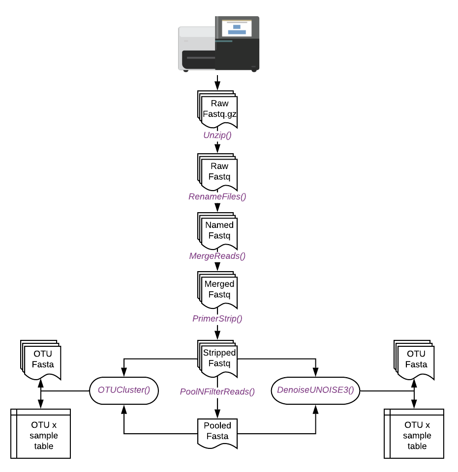

```{r setup, include = FALSE}
knitr::opts_chunk$set(
  collapse = TRUE,
  comment = "#>",
  eval = FALSE
)
```

## Analysing metabarcoding data using metabarTOAD
There are a great number of pipelines and methods for the analysis of metabarcoding data. No single method is appropriate or inappropriate in all situations. Methods and ideas are constantly being developed so keep an eye on the horizon and focus on fundamental and transferable skills. 
This tutorial is for beginners and demonstrates the workflow. 

### Requirements
#### Library design
This pipeline is designed to work with paired-end Illumina amplicon data generated from a 2-step PCR method as [Bista et al.2017](https://www.nature.com/articles/ncomms14087). We are expecting sufficient (>30bp) overlap of the paired end reads. 


#### Software
For this tutorial you will need the following 

* Cutadapt (version 2.0+)  [link](https://cutadapt.readthedocs.io/en/stable/installation.html)
* VSEARCH (version 2.10.4+) [link](https://github.com/torognes/vsearch)
* USEARCH (version 11+) [link](https://drive5.com/usearch/download.html)

These are already installed on the system for this tutorial. On your own system you may wish to have the executables in the folder with your analysis or you can have then in the PATH. Not sure about the PATH? - go [here](http://www.linfo.org/path_env_var.html) and have a read when you have some time. 

## Workflow Overview




## Setting up 
Make sure you start off with a clean folder in a new working directory, in this case we have some files and folders to help you get started so don't worry if you see these. Have a look with `dir()`. Let's start by loading up the required package(s)

```{r}
require(metabarTOAD)
```


Now we use the first command to set up the required folder structure. 

```{r}
Folders()
```

Great, lets check the folders. We can use `dir()` as before. We should see 8 folders with different names prefixed with a number.

Now we have a folder structure normally we would move our raw Illumina data into the `1.rawreads` but it should already be there for you. You might wish to copy your raw files into the `0.backup` folder as well in case you want to start the analysis again from scratch.

The pipeline can be run for multiple primer sets by providing sample and primer data in the required format. Download the examples [here](). This tutorial assumes we're only working on a single set of primers but provide primer and sample data.


## Unzipping and Counting
First lets check our files to make sure everything is as we expect.
```{r}
list.files("1.rawreads/")
```
We should have pairs of compressed sample files ready for analysis. 


Now everything is in place we can start to analyse the data. First lets unzip all the data, and then check to make sure everything has been unzipped. 
```{r}
Unzip()
list.files("1.rawreads/")
```

We can rename our files at this stage if we wish. First we pull the names from our metadata file.

```{r}
index <- read.csv("metadata.csv")
```

We now put the desired and current names into the function `RenameFiles` to change the names of our samples.

```{r}
RenameFiles(SeqIDs = as.character(index$RunID),DesiredIDs = as.character(index$RealID))
list.files("1.rawreads/")
```

If we prefer we can perform the same operation using the metadata sheet that we have copied into the base of the working directory with the below function. If you ran the above function then you have already renamed your files so no need to run the line below!  

```{r}
RenameFiles(usemetadatafile = TRUE)
```

Now we have everything named we can count the number of reads per sample. First we create a list of files to be counted.

```{r}
files <- list.files("1.rawreads",pattern=".fastq",full.names = TRUE)
```

Then we use `FastqCount` and `sapply`to count the reads for each sample. 

```{r}
rawreadcount <- sapply(files,FastqCount)
rawreadcount
```

We can calculate the mean and standard deviation of reads across the raw samples.

```{r}
mean(rawreadcount)
sd(rawreadcount)
```


## Merging and Filtering

Next we merge the forward and reverse reads as below. In this case we have already downloaded and installed usearch. You can see  

```{r}
MergeReads(usearchdest = "software/usearch")
```

We can count the number of merged reads like this. 

```{r}
mergedreadcount <- sapply(list.files("2.mergedreads",pattern=".fastq",full.names = TRUE),FastqCount)
mergedreadcount
```

Our sequences are now combined into a single fastq per read pair. Next we need to strip the primers from each end of the read. We do this as below. You can see the primer information and the maximum and minimum trim size of amplicon. In your own data you will want to change these values. We can then count the number of reads remaining after stripping primers.

```{r}
PrimerStrip(PrimerF = "NNNNNNGGWACWGGWTGAACWGTWTAYCCYCC",
            PrimerR = "TAIACYTCIGGRTGICCRAARAAYCA",
            MinLen = 303,
            MaxLen = 323,
            cutadaptdest = "cutadapt",
            ncores=1)

strippedreadcount <- sapply(list.files("3.strippedreads",pattern=".fastq",full.names = TRUE),FastqCount)
strippedreadcount 
```


Next we pool all our sequences together and discard singleton sequences (sequences only found once in the data). 

```{r}
PoolNFilterReads(vsearchdest="software/vsearch")
```


## Clustering and Denoising 

Now everything is prepped and ready to go we can generate 97% OTUs using the below command. 

```{r}
OTUCluster(usearchdest = "software/usearch")
```

Once this function has run then we should be able to load up our OTU by sample tab as below. We can use `dim` to check the size of our dataframe.

```{r}
initial.analysis <- read.csv("6.mappings/OTUtabs/AllSamples.raw.0.97.csv")
dim(initial.analysis)
```

Now just to check everything looks ok lets quickly look at the number of observed OTUs in our samples. 

```{r}
pdf("test.pdf",width=9,height=8)
barplot(colSums(initial.analysis != 0),las=2,ylab="Number of OTUs")
dev.off()

```
If everything has gone right then you should see something like this. 


Download the pdf using Filezilla and check.


If you have time try producing denoised OTUs (sometimes called MOTUS or ASVs or ESVs) using the UNOISE3 algorithm (paper [here](https://www.biorxiv.org/node/22505.abstract)). 

```{r}
DenoiseUNOISE3(usearchdest = "software/usearch")
```


When using the above two functions the OTUs will be output to the `5.OTUs` folder and the OTU by sample table to `6.mappings/OTUtabs`. These files can be used in downstream ecological analyses.  

## Post Clustering Curation with LULU

Very often in metabarcoding datasets we see a large number of OTUs with close percentage identity. These may correspond with intraspecific diversity, unfiltered PCR errors or other methodological foibles. One way to deal with these is to use the LULU algorithm (paper [here](https://www.nature.com/articles/s41467-017-01312-x)). A great tutorial is provided on the GitHub [page](https://github.com/tobiasgf/lulu), but you can just use the below wrapper script if you prefer. 

```{r}
library("lulu")

ApplyLulu(seqs="5.OTUs/AllSamples.0.97.OTUs.fasta",
          table="6.mappings/OTUtabs/AllSamples.raw.0.97.csv",
          output="8.LULU/post.lulu.curation.csv",
          vsearchdest="software/vsearch")

```

We can check the effect of LULU by examining the difference between the number of OTUs recognised in our pre and post lulu files. 

```{r}
post.lulu <- read.csv("8.LULU/post.lulu.curation.csv")

dim(initial.analysis)
dim(post.lulu)

```


How many OTUs did we collapse using LULU? 

